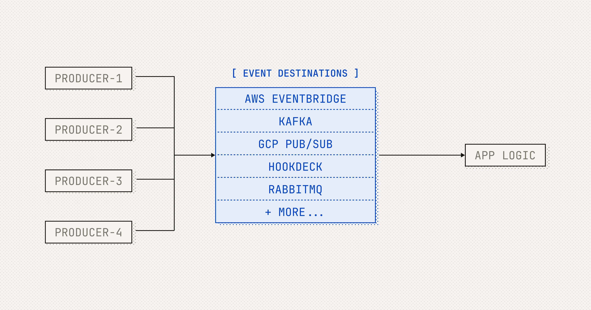

# Event Destinations Initiative

An initiative to support a new model for event interoperability between event producers and their consumers to favor better developer experience, robust integration, and infrastructural efficiency.

## What are Event Destinations

Event Destinations expand the capabilities of event producers and benefit event consumers by providing more efficient and reliable event delivery options beyond just traditional webhooks.

Event Destinations are endpoints or systems to which event producers can send events and give the developer the choice to use the tools they are familiar with directly. For example:

- Google Cloud Pub/Sub
- AWS SQS
- Hookdeck Event Gateway
- Amazon EventBridge
- Kafka
- RabbitMQ
- And, of course, traditional HTTP webhooks

Event Destinations benefit event producers and event consumers.

For event producers:

- **Efficiency gains**: Reduced failure rates and retried deliveries compared to public HTTP endpoints.
- **Protocol flexibility**: Leverage more efficient protocols and encodings.
- **Batch publishing**: Unlock improved performance for high-throughput scenarios.

For event consumers:

- **Streamlined infrastructure & operations**: Eliminate the need for API gateways, load balancers, HTTP consumers, and other infrastructure components, reducing maintenance overhead.
- **Predictable behavior**: Standardize event expectations—the message bus handles timeouts, retries, and security.

## Event Destinations Specification

The latest draft version of the specification is in [specification.md](specification.md).

## Get Involved

Read [CONTRIBUTING.md](CONTRIBUTING.md) to learn how to contribute to this repository.

We use GitHub Discussions for:

- [General discussions](https://github.com/hookdeck/eventdestinations/discussions/new?category=ideas)
- [New ideas](https://github.com/hookdeck/eventdestinations/discussions/new?category=ideas)
- [Q&A](https://github.com/hookdeck/eventdestinations/discussions/new?category=q-a)

## Learn More

Visit the [Event Destinations Initiative website](https://eventdestinations.org) to learn more.