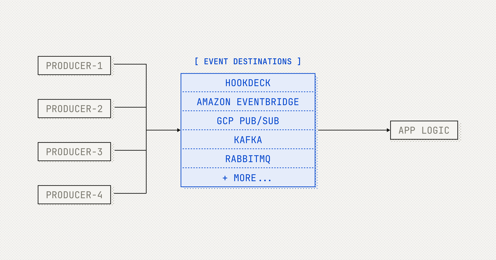

# Event Destinations Initiative

An initiative to support a new model for event interoperability between event producers and their consumers to favor better developer experience, robust integration, and infrastructural efficiency.

## What are Event Destinations

Event Destinations expand the capabilities of event producers and benefit event consumers by providing more efficient, reliable, and flexible event delivery options. Event Destinations champion a range of event destinations types beyond just traditional webhooks, allowing developers to use the tools they are most familiar with.

Event Destinations are endpoints or systems to which event producers can send events and give the developer the choice to use the tools they are familiar with directly. For example:

- Google Cloud Pub/Sub
- AWS SQS
- Hookdeck Event Gateway
- Amazon EventBridge
- Kafka
- RabbitMQ
- And, of course, traditional HTTP webhooks

Event Destinations benefit event producers and event consumers.

For event producers:

- **Efficiency gains**: Reduced failure rates and retried deliveries compared to public HTTP endpoints. Unlock improved performance for high-throughput scenarios.
- **Protocol flexibility**: Leverage more efficient protocols and encodings.
- **Cost & resource efficient**: Smart retry logic, improved deliverability and scalable infrastructure minimize resource consumption, reducing operational costs while ensuring seamless event delivery at any scale.

For event consumers:

- **Streamlined infrastructure and operations**: Eliminate the need for API gateways, load balancers, HTTP consumers, and other infrastructure components, reducing maintenance overhead.
- **Reduced developer burden**: Receive events directly to existing or preferred infrastructure and make use of existing and familiar ecosystem tooling.
- **Predictable behavior**: Standardize event expectations—the message bus handles timeouts, retries, and security.

## Event Destinations Specification

The latest draft version of the specification is in [specification.md](specification.md).

## Get Involved

Read [CONTRIBUTING.md](CONTRIBUTING.md) to learn how to contribute to this repository.

We use GitHub Discussions for:

- [General discussions](https://github.com/hookdeck/eventdestinations/discussions/new?category=ideas)
- [New ideas](https://github.com/hookdeck/eventdestinations/discussions/new?category=ideas)
- [Q&A](https://github.com/hookdeck/eventdestinations/discussions/new?category=q-a)

## Related Initiatives

- [Async API](https://www.asyncapi.com)
- [CloudEvents](https://cloudevents.io/)
- [Webhook standardization projects](https://webhooks.fyi/learn-more/standards)

## Learn More

Visit the [Event Destinations Initiative website](https://eventdestinations.org) to learn more.